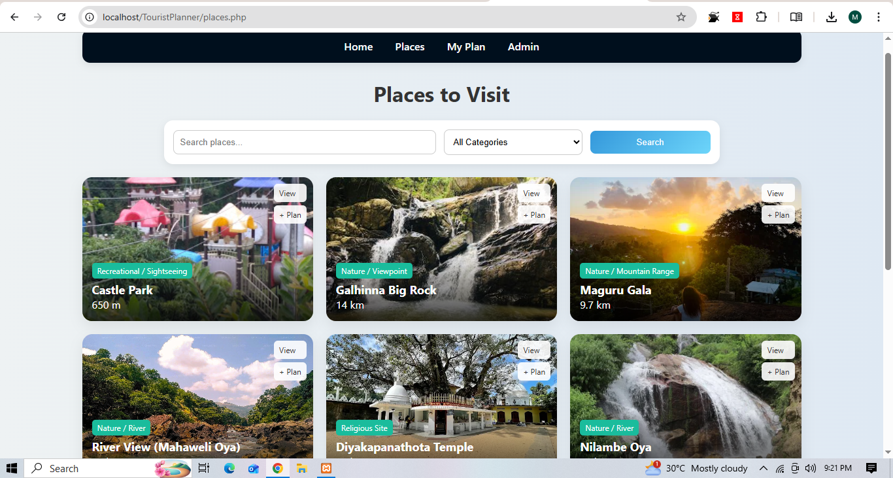
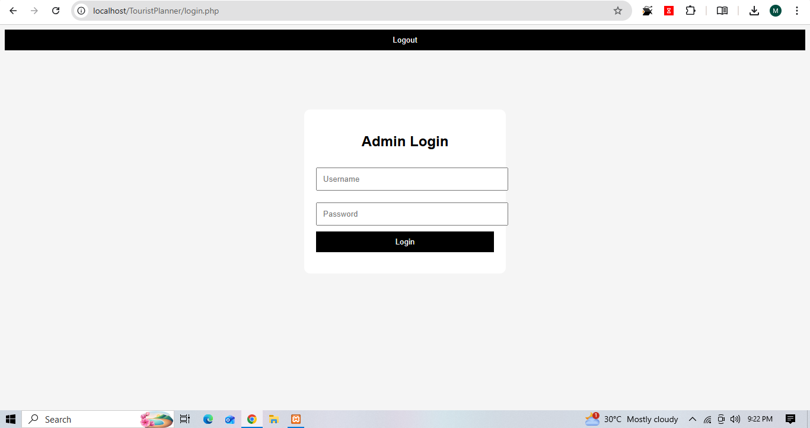

# TouristPlanner

## Project Overview

TouristPlanner is a web-based tourist day-visit planning system developed using PHP and MySQL. The system allows users to explore tourist destinations, view place details, and plan visits through an interactive interface with admin management features.
---

## Technologies Used

- PHP
- MySQL
- HTML
- CSS
- JavaScript
- XAMPP

---

## Features

- Tourist destination listing
- Admin dashboard
- Add, edit and delete places
- Image gallery
- Trip planning pages
- Database connectivity
- Responsive user interface

---

## Project Structure

- `admin/` - Admin related pages
- `css/` - Stylesheets
- `js/` - JavaScript files
- `images/` - Project images and assets
- `db.php` - Database connection
- `index.php` - Homepage

---
## Screenshots

### Welcomepage


### Homepage


### Admin Dashboard


## How to Run the Project

1. Download or clone the repository
2. Move the project folder into the `htdocs` folder in XAMPP
3. Start Apache and MySQL using XAMPP
4. Import the database into phpMyAdmin
5. Open the project in browser using:

```text
http://localhost/TouristPlanner
```

---

## Future Improvements

- User login and registration system
- Online booking functionality
- Payment integration
- Mobile responsive improvements
- Search and filter features

---

## Author

Maryam Tharik Ali
